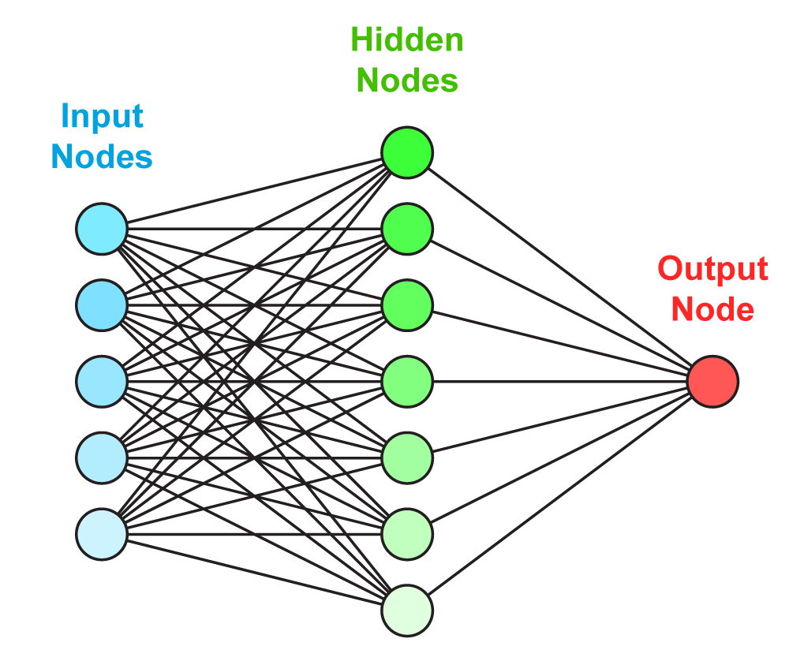

# neuralnet-bikerentals
An implementation of simple Neural Network (1 hidden layer) to predict daily bike rentals using mainly [Numpy](www.numpy.org/)

## How to Open

The code is presented in a [Jupyter Notebook](https://github.com/jupyter/notebook) / iPython notebook.

Open [``bike-sharing-neural-net.ipynb``](https://github.com/adsasmita/neuralnet-bikerentals/blob/master/bike-sharing-neural-net.ipynb) on desktop browser or download it, and run the cells in a Python 3 environment.

  

## Overview

The data for this project is obtained from [UC Irvine Machine Learning Repository](https://archive.ics.uci.edu/ml/datasets/Bike+Sharing+Dataset)

## Dataset Information

Bike sharing systems are new generation of traditional bike rentals where whole process from membership, rental and return back has become automatic. Through these systems, user is able to easily rent a bike from a particular position and return back at another position. Currently, there are about over 500 bike-sharing programs around the world which is composed of over 500 thousands bicycles. Today, there exists great interest in these systems due to their important role in traffic, environmental and health issues. 

Apart from interesting real world applications of bike sharing systems, the characteristics of data being generated by these systems make them attractive for the research. Opposed to other transport services such as bus or subway, the duration of travel, departure and arrival position is explicitly recorded in these systems. This feature turns bike sharing system into a virtual sensor network that can be used for sensing mobility in the city. Hence, it is expected that most of important events in the city could be detected via monitoring these data.

## Dependencies

* [Numpy](http://www.numpy.org/)
* [Pandas](http://pandas.pydata.org/)
* [matplotlib](http://matplotlib.org/)

